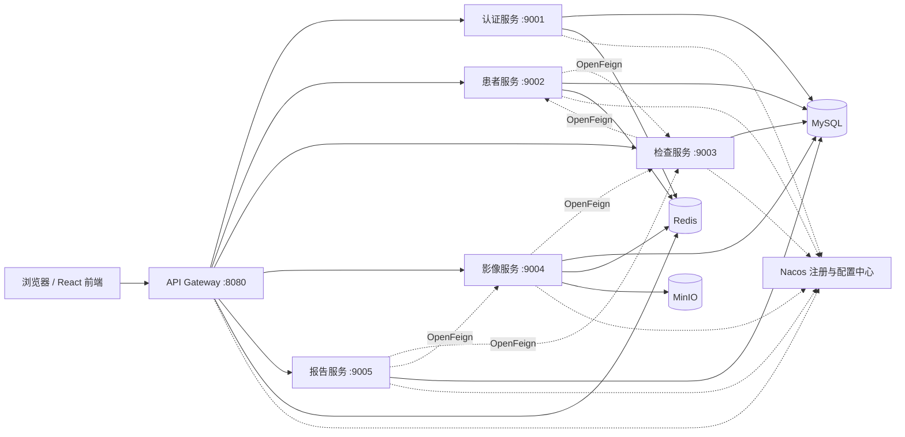
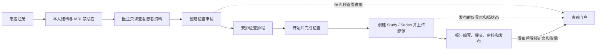
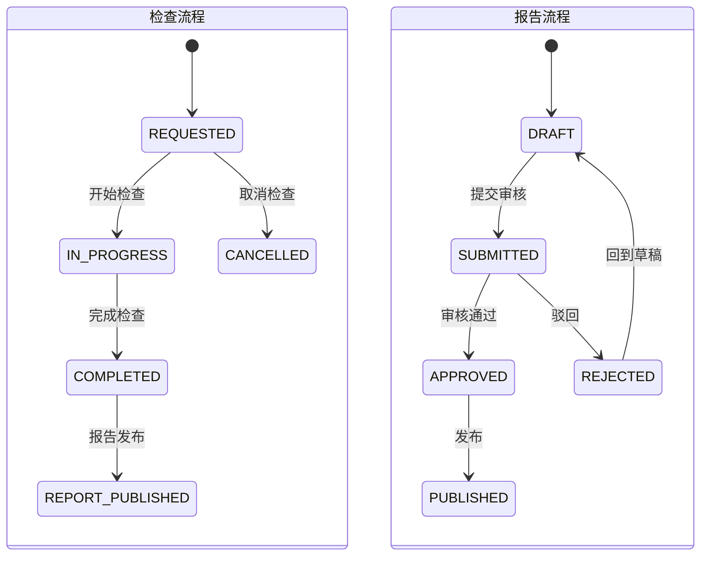

# 医院核磁共振图像信息管理分布式微服务系统

本项目是一套基于 Spring Boot 3 与 Spring Cloud 的医院核磁共振图像信息管理系统，覆盖患者自助建档、MRI 禁忌症、检查申请与排程、检查执行、影像归档与上传、诊断报告审核发布，以及患者本人进度查询。系统通过医生和患者双角色实现数据权限隔离，并使用 Gateway、Nacos、OpenFeign、Redis、MySQL 和 MinIO 构建可验证的分布式业务链路。

核心能力：

- **双角色协作**：`admin` 作为医生处理医疗业务，`PATIENT` 患者维护本人资料并查看处理进度。
- **完整业务闭环**：患者建档 → 检查申请 → 检查排程 → 检查执行 → 影像归档 → 报告审核发布。
- **本人数据隔离**：患者只能访问本人资料、检查、影像和报告；医生对患者本人资料保持只读。
- **发布门禁**：报告发布前患者只能看到状态，发布后才开放报告正文和关联影像。
- **分布式基础设施**：统一网关、注册发现、远程调用、缓存、关系数据库和对象存储均可独立验证。

## 角色与权限

| 能力 | admin 医生 | PATIENT 患者 |
| --- | --- | --- |
| 账号入口 | 使用预置 admin 登录 | 在登录页注册患者账号 |
| 患者资料 | 搜索和只读查看资料、禁忌症、检查历史 | 首次建档并维护本人资料和禁忌症 |
| 检查业务 | 创建申请、排程、开始、完成或取消检查 | 只读查看本人申请、排程和状态 |
| 影像业务 | 创建 Study/Series、上传、预览和管理影像 | 发布前查看归档进度，发布后查看本人影像 |
| 报告业务 | 编写、提交、审核、驳回、回到草稿和发布 | 发布前查看审核进度，发布后查看报告正文 |
| 系统能力 | 系统设置、操作记录、审核与下载记录 | 不显示系统设置、操作记录或内部日志 |

身份与权限规则：

- 正式前端请求统一通过 `8080` 网关，网关校验 JWT 后重新注入可信用户和角色信息。
- 401 表示登录状态失效，前端清除会话并提示重新登录。
- 403 表示当前账号没有权限，前端保留会话并显示用户可理解的提示。
- 患者门户每 5 秒静默刷新本人检查、影像和报告；标签页隐藏时暂停，恢复时立即刷新。

## 系统架构



架构说明：

- **React/Vite 前端**只访问 Gateway，不绕过网关直连业务服务。
- **Gateway**负责路由、JWT 校验、401/403 区分和可信身份头注入。
- **OpenFeign**承担患者、检查、影像和报告服务之间的归属及业务状态查询。
- **MySQL**保存账号、患者、禁忌症、检查、排程、影像元数据、报告和审核记录。
- **Redis**用于患者/影像缓存及 token 黑名单。
- **MinIO**保存真实影像对象，MySQL 仅保存对象路径、文件名和校验值等元数据。
- **Nacos**提供服务注册发现和动态配置验证。

### 服务、端口与职责

| 模块或基础设施 | 默认端口 | 主要职责 |
| --- | ---: | --- |
| `mri-frontend` | 5173 | React 医生工作台与患者门户 |
| `mri-gateway` | 8080 | API 统一入口、JWT 和角色权限 |
| `mri-auth-service` | 9001 | 登录、注册、当前用户、用户与角色 |
| `mri-patient-service` | 9002 | 患者本人档案、禁忌症和检查历史 |
| `mri-exam-service` | 9003 | 检查申请、排程和状态流转 |
| `mri-image-service` | 9004 | Study、Series、影像文件、MinIO 与预览 |
| `mri-report-service` | 9005 | 报告编写、审核、驳回、重开和发布 |
| MinIO API | 9000 | 影像对象存储接口 |
| MinIO 控制台 | 9101 | 对象存储管理页面 |
| Nacos | 8848 | 服务注册发现与配置中心 |
| MySQL | 3307 | 业务数据与系统配置 |
| Redis | 6379 | 缓存和 token 黑名单 |

## 技术栈

- Java 21
- Spring Boot 3.3.x
- Spring Cloud 2023.0.x
- Spring Cloud Alibaba Nacos 2023.0.3.4
- Spring Cloud Gateway、OpenFeign、springdoc-openapi
- MyBatis-Plus 3.5.x
- MySQL 8、Redis 7、Nacos 2.4、MinIO
- React、react-router、Vite 8

## 业务流程



### 检查排程的业务作用

检查排程把检查申请落实到具体设备，确定检查时间并分配执行人员；统一排程可避免设备和时间冲突，并为检查状态流转及后续影像归档提供业务依据。

## 功能说明

### 医生端

- 使用 `admin` 登录医生工作台，查看患者、检查、影像和报告数量概览。
- 搜索并只读查看患者基本资料、MRI 禁忌症和检查历史。
- 为已建档患者创建检查申请，设置检查项目、临床诊断和优先级。
- 将申请安排到具体 MRI 检查室、时间和执行技师。
- 按原业务状态机执行开始、完成和取消操作。
- 检查完成后创建 Study、Series，并通过 Multipart 上传真实影像到 MinIO。
- 编写诊断报告，执行提交、审核通过、驳回、回到草稿和发布。
- 查看系统设置、操作记录、报告审核日志和影像下载记录。

### 患者端

- 在登录页使用姓名、用户名和密码注册患者账号；服务端固定分配 `PATIENT`。
- 首次登录后提交本人资料，并同时选择有无 MRI 禁忌症。
- 有禁忌症时可维护多条类型、描述和严重程度记录。
- 后续只能维护与当前登录用户名绑定的本人资料和禁忌症。
- 只读查看本人检查申请、排程、影像归档和报告审核进度。
- 报告发布前不返回报告正文，也不开放影像 manifest 和文件内容。
- 报告发布后查看完整影像所见、诊断意见和关联影像。
- 页面每 5 秒静默刷新；自动刷新不弹提示、不写操作日志。

### 公共技术能力

- JWT 登录认证、token 刷新和退出黑名单。
- Gateway 四态鉴权：公开、已授权、未认证和无权限。
- 客户端身份头清理与网关可信身份头重建。
- 页面顶部成功、警告和失败提示，HTTP/网络异常转换为用户语言。
- Nacos 注册发现、OpenFeign 远程调用和动态配置刷新。
- Redis 缓存一致性与失效处理。
- MySQL 幂等迁移与 UTF-8 安全系统名称。
- MinIO bucket 自恢复、上传、读取、删除和空对象验证。
- springdoc-openapi 自动生成五个服务的 Swagger/OpenAPI 文档。

## 状态流转



## 快速运行

### 1. 启动基础设施和后端服务

推荐使用脚本后台启动，避免 `spring-boot:run` 在当前终端阻塞：

```powershell
./scripts/demo/01-start-infra.ps1
./scripts/demo/02-start-services.ps1
```

基础设施脚本会启动 MySQL、Redis、Nacos 和 MinIO，并对已有数据库执行患者账号幂等迁移。

如果本机 `8080` 已被占用，可临时修改网关端口：

```powershell
./scripts/demo/02-start-services.ps1 -GatewayPort 18080
```

如需手动启动，每个命令应在独立终端运行：

```powershell
mvn -DskipTests install
mvn -pl mri-auth-service spring-boot:run
mvn -pl mri-patient-service spring-boot:run
mvn -pl mri-exam-service spring-boot:run
mvn -pl mri-image-service spring-boot:run
mvn -pl mri-report-service spring-boot:run
mvn -pl mri-gateway spring-boot:run
```

### 2. 启动前端

```powershell
Set-Location mri-frontend
npm install
npm run dev
```

如果网关使用了非默认端口：

```powershell
$env:VITE_API_PROXY_TARGET="http://localhost:18080"
npm run dev
```

浏览器访问：`http://localhost:5173`

前端采用 React + react-router 按功能分页，从登录页进入。主要页面：

- 登录页与患者注册。
- 医生工作台和只读患者档案。
- 检查申请与排程。
- 影像归档、上传和预览。
- 诊断报告处理。
- 患者本人的资料、检查、影像和报告页面。
- 医生可见的系统设置与操作记录。

### 3. 默认医生账号

```text
用户名：admin
密码：admin123
```

患者账号在登录页注册；注册成功后首次登录并自行完成患者资料。

网关统一入口：`http://localhost:8080/api/**`

## Swagger 与接口数量

各服务 Swagger：

- Auth：`http://localhost:9001/swagger-ui.html`
- Patient：`http://localhost:9002/swagger-ui.html`
- Exam：`http://localhost:9003/swagger-ui.html`
- Image：`http://localhost:9004/swagger-ui.html`
- Report：`http://localhost:9005/swagger-ui.html`

已通过 `scripts/demo/04-api-docs-count.ps1` 对实时 OpenAPI 文档计数：

| 模块 | 接口数 |
| --- | ---: |
| Auth/User | 10 |
| Patient | 15 |
| Exam | 18 |
| Image | 22 |
| Report | 13 |
| **合计** | **78** |

患者本人能力包括 `/auth/register`、`/patients/me`、`/exams/mine`、`/images/mine/**` 和 `/reports/mine`；所有正式前端请求仍通过 `/api/**` 网关路径访问。

## 测试结果

测试命令：

```powershell
mvn clean test
Set-Location mri-frontend
npm test
npm run build
npm audit --json
```

已执行结果：

| 验证项 | 结果 |
| --- | --- |
| 后端 `mvn clean test` | 58 项通过，0 失败、0 错误、0 跳过 |
| 前端 `npm test` | 9 项通过，0 失败 |
| 前端生产构建 | Vite 8.0.16，1582 个模块，构建成功 |
| `npm audit --json` | 0 个漏洞 |
| OpenAPI 统计 | 78 个接口 |
| 医生/患者双账号端到端闭环 | 通过 |
| 最终零数据验证 | 通过 |

### 双账号端到端验证

已通过真实网关和两个隔离会话验证：

1. 患者在登录页注册 `patient01`，并完成首次建档。
2. 患者提交金属植入物禁忌症，顶部成功提示正常。
3. 医生只读查看患者资料和禁忌症。
4. 医生完成检查申请、排程、开始和完成检查。
5. 医生创建 Study、Series，并通过 Multipart 上传真实影像。
6. 医生创建、提交、审核并发布报告。
7. 发布前患者报告正文为空，影像 manifest 返回 403。
8. 发布后患者可查看完整报告和关联影像。
9. PATIENT 调用医生写接口返回 403，患者会话保持有效。

完整证据见[测试执行结果](docs/demo/test-result.md)。

## 最终交付状态

端到端验证结束后已执行：

```powershell
powershell -ExecutionPolicy Bypass -File scripts/db/clear-runtime-data.ps1
```

最终状态：

| 清理或保留项 | 结果 |
| --- | --- |
| 十张业务表 | 全部为 0 |
| PATIENT 测试账号 | 0 |
| Redis `DBSIZE` | 0 |
| MinIO `mri-images` | 0 B、0 objects，保留空 bucket |
| `storage/mri-images` 运行文件 | 0，仅保留 `.gitkeep` |
| admin 医生账号 | 保留并启用 |
| `PATIENT` 及其他系统角色 | 保留 |
| Nacos、MySQL、Redis、MinIO 配置 | 保留 |

清理脚本会预检 Docker，并在数据库、Redis 或 MinIO 任一步失败时以非零状态终止。最终冒烟只执行 admin 登录、`/api/auth/me` 和空列表查询，不再注册患者或创建业务记录。

## 运行验证脚本

按顺序执行 `scripts/demo/` 下的验证脚本：

```powershell
./scripts/demo/01-start-infra.ps1
./scripts/demo/02-start-services.ps1
./scripts/demo/03-login.ps1
./scripts/demo/04-api-docs-count.ps1
./scripts/demo/05-redis-cache.ps1
./scripts/demo/06-nacos-register-deregister.ps1
./scripts/demo/07-feign-remote-call.ps1
./scripts/demo/08-gateway-access.ps1
./scripts/demo/09-nacos-config-refresh.ps1
./scripts/demo/10-git-demo.ps1 -RemoteUrl "https://github.com/ShirokoGranblue/MRI-web.git"
```

## 扩展文档

- [产品操作手册](docs/product-manual.md)
- [测试执行结果](docs/demo/test-result.md)
- [接口数量说明](docs/api-endpoint-count.md)
- [开发难点与解决过程](docs/development-challenges.md)
- [A 方式无口播字幕脚本](docs/demo/video-caption-script.md)
