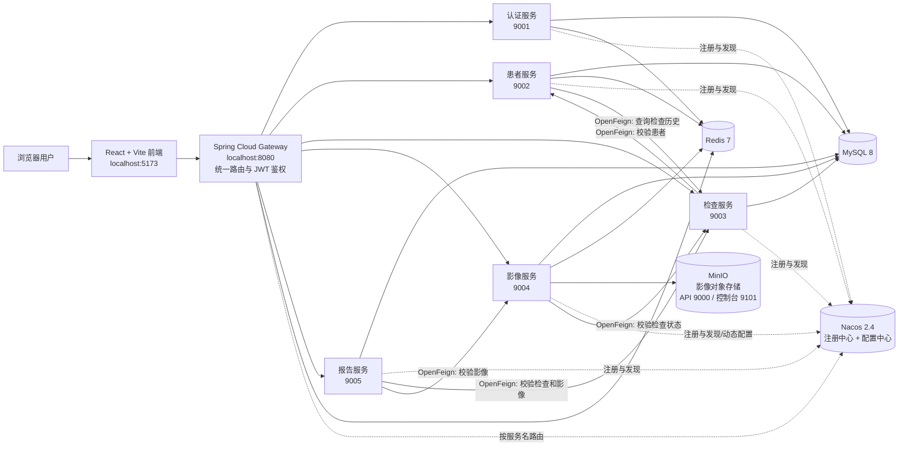

# MRI 分布式医疗信息系统演示视频讲稿

## 1. 开场：先讲项目解决什么问题

可直接口播：

> 本项目是一套基于 Java 21、Spring Boot 3 和 Spring Cloud 构建的医院核磁共振影像管理系统。它不是单纯的患者增删改查，而是把患者建档、MRI 检查申请、检查排程、检查执行、影像归档、真实影像上传、诊断报告审核发布串成一条完整业务链。项目采用微服务架构，并使用 Nacos、Gateway、OpenFeign、Redis、MySQL 和 MinIO，覆盖了原始考核要求中的接口文档、缓存、测试、Git、认证、注册中心、服务调用、网关和配置中心等内容。

项目的核心业务流程：

```text
患者建档
  -> MRI 禁忌症登记
  -> 创建检查申请
  -> 安排检查排程
  -> 开始检查
  -> 完成检查
  -> 归档影像检查
  -> 添加影像序列并上传图像
  -> 编写诊断报告
  -> 提交、审核、驳回或发布
```

## 2. 检查申请和检查排程有什么区别

这是演示时必须讲清楚的一组概念。

### 2.1 检查申请：描述“为什么查、查什么”

检查申请是临床业务单据，关联患者，并记录：

- 检查项目，例如“头颅 MRI 平扫”；
- 临床诊断，例如“头痛待查”；
- 优先级，例如“普通”或“加急”；
- 当前状态，例如待检查、检查中、已完成、已取消、已出报告。

它解决的是“这位患者是否需要做 MRI、需要做什么项目”的问题。

### 2.2 检查排程：描述“什么时候、在哪里、由谁做”

检查排程是检查申请进入实际执行阶段后的资源安排，记录：

- `examOrderId`：对应哪一张检查申请；
- `scannerRoom`：安排在哪个 MRI 检查室或设备；
- `scheduledAt`：预约执行时间；
- `technologist`：负责执行的技师。

它解决的是“这张申请具体什么时候做、占用哪台设备、由哪位技师执行”的问题。

可直接口播：

> 检查申请相当于医生开出的检查单，排程相当于影像科拿到检查单后安排机房、时间和技师。两者分开设计，是因为临床申请和设备资源调度属于不同职责。删除检查申请时，系统会连带删除相关排程，避免留下失去业务归属的预约记录。

### 2.3 当前项目的真实能力边界

当前排程模块已经实现新增、修改、详情、列表和删除，并在删除检查申请时级联删除相关排程。它是课程演示级的资源安排模型，目前没有实现：

- 同一检查室的时间冲突检测；
- 技师排班冲突检测；
- 短信或消息提醒；
- 日历视图；
- “必须存在排程才能开始检查”的强制约束。

演示时应表述为“实现了基础检查资源排程”，不要描述成完整医院排班平台。

## 3. 系统架构



### 3.1 为什么拆成这些服务

- `mri-auth-service`：用户、角色、登录、登出和 JWT 签发；
- `mri-patient-service`：患者档案、MRI 禁忌症和检查历史；
- `mri-exam-service`：检查申请、排程和检查状态流转；
- `mri-image-service`：影像检查、序列、文件、MinIO 存储、预览和下载审计；
- `mri-report-service`：诊断报告、审核状态和审核日志；
- `mri-gateway`：外部请求的统一入口、路由、鉴权和基础角色控制；
- `mri-common`：统一响应、异常处理、JWT、MyBatis-Plus 和 OpenAPI 公共配置；
- `mri-frontend`：面向用户的 React 工作台。

拆分依据是业务职责，而不是简单地按 Controller、Service、Mapper 技术层拆服务。这样患者、检查、影像、报告可以独立演进，同时通过服务调用完成业务协作。

## 4. 使用了哪些技术，分别解决什么问题

| 技术 | 在项目中的实际用途 |
| --- | --- |
| Java 21 | 后端开发语言和运行环境 |
| Spring Boot 3.3 | 构建各业务微服务、REST API、配置和依赖注入 |
| Spring Cloud 2023 | 微服务基础能力和版本体系 |
| Spring Cloud Alibaba Nacos | 服务注册发现、服务上下线展示、影像服务配置动态刷新 |
| Spring Cloud Gateway | 所有前端业务请求的统一入口；JWT 校验、角色限制、服务路由 |
| OpenFeign | 检查服务校验患者、患者服务查询检查历史、影像服务校验检查状态、报告服务校验检查和影像并回写状态 |
| MyBatis-Plus | Mapper、分页、逻辑删除、乐观锁和数据库 CRUD |
| MySQL 8 | 保存用户、患者、禁忌症、检查申请、排程、影像元数据、报告和审核日志 |
| Redis 7 | 患者详情缓存、影像检查/预览清单缓存、登出 token 黑名单 |
| MinIO | 保存真实上传的影像文件；数据库只保存对象 key 和 SHA-256 校验值 |
| JWT HMAC-SHA256 | 登录后生成带用户名、角色、签发时间和过期时间的访问凭证 |
| springdoc-openapi | 为各服务自动生成 Swagger/OpenAPI 接口文档 |
| React 18 + Vite + React Router | 构建登录页、工作台和各业务页面，通过网关访问后端 |
| Docker Compose | 一键启动 MySQL、Redis、Nacos、MinIO |
| Maven Reactor | 统一构建和测试多个后端模块 |
| JUnit 5 + Mockito + MockMvc | 单元测试服务规则、缓存、远程调用和 multipart 接口绑定 |
| Git | 版本管理、提交和远程推送演示 |

## 5. 系统实现了什么功能

### 5.1 认证与用户

- 使用账号密码登录；
- 密码以加盐哈希形式保存；
- 登录成功签发 JWT；
- 网关统一校验 token、过期时间和角色；
- 登出 token 写入 Redis 黑名单；
- 失效会话自动回到登录页；
- 用户管理接口仅允许管理员角色访问。

### 5.2 患者档案

- 患者新增、修改、删除、详情、分页和搜索；
- 登记、查看和删除 MRI 禁忌症；
- 通过患者服务调用检查服务，展示患者真实检查历史；
- 患者详情使用 Redis 缓存，修改或删除后主动清理缓存。

### 5.3 检查申请和排程

- 创建检查申请前，通过 OpenFeign 校验患者存在；
- 维护检查项目、临床诊断和优先级；
- 安排检查室、预约时间和执行技师；
- 状态流转：待检查 -> 检查中 -> 已完成 -> 已出报告；
- 待检查或检查中可取消；
- 状态守卫防止跳过步骤；
- 删除检查申请时级联删除排程。

### 5.4 影像归档与对象存储

- 只有已完成的检查才能归档影像；
- 管理影像检查、影像序列和影像文件；
- multipart 文件通过网关上传到影像服务；
- 文件写入 MinIO 的 `mri-images` 桶；
- 数据库保存文件名、对象 key 和 SHA-256 校验值；
- 通过受 JWT 保护的接口读取文件并显示真实缩略图；
- 删除影像文件、序列或影像检查时同步清理 MinIO 对象；
- MinIO 晚启动时，上传前自动检查并补建桶；
- 支持影像下载原因和下载审计记录；
- 影像预览清单使用 Redis 缓存。

### 5.5 诊断报告

- 只有检查已完成且影像已归档时才能创建报告；
- 维护影像所见和诊断意见；
- 报告状态流转：草稿 -> 待审核 -> 已审核 -> 已发布；
- 支持驳回，并允许回到草稿修改后重新提交；
- 每次状态变化写入审核日志；
- 报告发布后，通过 OpenFeign 回写检查状态为“已出报告”。

### 5.6 前端工作台

- 登录页和未登录路由保护；
- 工作台数据概览和待办入口；
- 患者、检查、影像、报告、设置、操作记录分页面展示；
- 下拉框选择业务对象，避免用户手工输入数据库 ID；
- 根据业务状态启用或禁用按钮；
- 技术错误码转换成用户可理解的中文；
- 所有请求统一经过 API 网关。

## 6. 原始 10 项考核要求如何对应

### 要求 1：接口文档和不少于 50 个接口

- 项目当前实现 69 个业务/演示接口；
- 五个业务服务均通过 springdoc-openapi 暴露 `/v3/api-docs` 和 Swagger UI；
- 执行 `scripts/demo/04-api-docs-count.ps1`，现场统计接口总数并断言不得少于 50。

演示画面：依次打开各服务 Swagger，随后执行接口统计脚本，展示 `Total APIs`。

### 要求 2：Redis 中间件和数据库缓存

- 患者详情缓存：`mri:patient:{id}`；
- 影像检查缓存：`mri:study:{studyId}`；
- 影像预览清单缓存：`mri:viewer:{studyId}`；
- 登出 token 黑名单也保存在 Redis；
- 修改、删除相关数据后主动删除缓存，保证数据库和缓存一致。

演示画面：执行 `scripts/demo/05-redis-cache.ps1`，第一次查询填充缓存，第二次查询复用缓存，再通过 `redis-cli keys "mri:*"` 展示 key。

### 要求 3：单元测试代码和执行结果

- 后端使用 JUnit 5、AssertJ、Mockito、MockMvc；
- 覆盖登录、缓存、检查状态守卫、远程调用、报告审核、MinIO 上传和 multipart 参数绑定；
- 前端使用 Node Test Runner 覆盖 401 会话清理和用户化错误提示；
- 正式录制前执行 `mvn clean test` 和 `npm test`，以终端结果为准展示测试数量和零失败。

演示画面：展示测试源码，再展示 Maven `BUILD SUCCESS` 和前端测试全部通过。

### 要求 4：Git 提交和推送到远程仓库

- 先执行 `git status --short` 展示改动；
- 执行 `git add` 和带有 Conventional Commit 风格说明的 `git commit`；
- 执行 `git log --oneline -5` 展示提交历史；
- 最后执行 `git push` 并打开远程仓库确认提交。

当前已存在的完整功能提交：`43235bc feat: complete MRI management workflow`。正式视频中的推送必须使用自己的真实远程仓库，不要只展示脚本文件。

### 要求 5：登录认证

- `mri-auth-service` 校验用户名和密码，签发 HMAC-SHA256 JWT；
- JWT 包含用户名、角色、签发时间和过期时间；
- `mri-gateway` 统一验证 JWT；
- 登出后 token 进入 Redis 黑名单。

演示画面：无 token 访问患者接口得到 401；登录后携带 token 通过网关访问成功；退出后原 token 再次被拒绝。

### 要求 6：服务注册与发现

- 所有微服务注册到 Nacos；
- 网关和 OpenFeign 通过服务名寻找实例；
- 执行 `scripts/demo/06-nacos-register-deregister.ps1`，停止影像服务后观察 Nacos 实例下线，再重启观察重新注册。

演示画面：Nacos 服务列表、实例健康状态、下线和重新上线过程。

### 要求 7：多个服务之间的数据交换和远程调用

项目包含多条真实 OpenFeign 调用链：

1. 检查服务 -> 患者服务：创建检查申请前校验患者存在；
2. 患者服务 -> 检查服务：查询患者检查历史；
3. 影像服务 -> 检查服务：归档前校验检查已完成；
4. 报告服务 -> 检查服务、影像服务：创建报告前校验检查和影像；
5. 报告服务 -> 检查服务：报告发布后回写“已出报告”状态。

演示画面：执行 `scripts/demo/07-feign-remote-call.ps1`，边执行边说明每一次跨服务调用的发起方、目标服务和业务目的。

### 要求 8：API 服务网关

- 前端只访问 `localhost:8080/api/**`；
- Gateway 根据路径转发到不同服务；
- Gateway 在转发前统一执行 JWT 和角色校验；
- 外部用户不需要知道五个服务的真实端口。

演示画面：执行 `scripts/demo/08-gateway-access.ps1`，对比无 token 被拒绝和有 token 成功。

### 要求 9：配置中心和实时修改配置

- Nacos Config 保存 `mri-image-service.yaml`；
- 可动态修改影像水印、下载开关和缓存时间；
- `ImageDemoProperties` 在运行中刷新，无需重启影像服务。

演示画面：先读取当前配置，执行 `scripts/demo/09-nacos-config-refresh.ps1`，等待刷新后再次读取，展示水印和下载开关变化。

### 要求 10：开发难点和解决过程

建议选择三到四个最有代表性的难点讲清楚“现象—原因—解决—验证”：

1. Spring Boot、Spring Cloud、Spring Cloud Alibaba 版本兼容：通过 BOM 统一依赖版本；
2. 网关 JWT 和登出黑名单：登录白名单、业务接口鉴权、Redis 黑名单；
3. Redis 缓存一致性：查询填充缓存，修改和删除主动失效；
4. 跨服务业务一致性：使用 OpenFeign 校验患者、检查和影像状态；
5. MinIO 上传：网关 multipart、对象存储、数据库元数据、自动建桶和级联清理；
6. 前端用户化：不把 Study、Series、UID、HTTP 状态码直接暴露给普通用户。

影像上传 500 的实际排查也可以作为开发难点案例：

> 最初上传返回 500。通过影像服务日志发现连接 `localhost:9000` 被拒绝，继续检查 Docker 运行状态发现启动脚本漏掉了 MinIO；同时 MinIO 控制台与认证服务都占用 9001。最终将 MinIO 加入基础设施脚本，保留 9001 给认证服务，将 MinIO 控制台改到 9101，并增加上传前自动检查和创建桶。随后通过真实网关完成上传、读取和删除验证。

## 7. 推荐的视频录制顺序

建议控制在 10 至 15 分钟：

1. **0:00—0:40 项目定位**：讲系统解决的问题和完整业务闭环；
2. **0:40—1:40 架构图**：讲前端、网关、五个微服务、Nacos、Redis、MySQL、MinIO；
3. **1:40—2:30 启动基础设施和服务**：展示 Docker Compose、Nacos 服务列表、MinIO 控制台；
4. **2:30—3:10 登录和网关鉴权**：无 token 失败、登录后成功；
5. **3:10—3:50 Swagger 和 69 个接口**：打开文档并执行统计脚本；
6. **3:50—7:30 业务主流程**：患者 -> 禁忌症 -> 检查申请 -> 排程 -> 开始/完成 -> 影像归档 -> 上传 -> 报告审核发布；
7. **7:30—8:20 Redis 缓存**：展示缓存 key 和一致性处理；
8. **8:20—9:10 OpenFeign**：解释四条以上跨服务调用；
9. **9:10—9:50 Nacos 注册发现**：服务下线和重新注册；
10. **9:50—10:30 Nacos 配置刷新**：实时改变水印或下载开关；
11. **10:30—11:20 单元测试**：展示测试源码和执行结果；
12. **11:20—12:10 Git**：展示提交历史、提交和推送；
13. **12:10—13:00 开发难点与总结**：重点讲缓存一致性、网关鉴权、MinIO 上传。

## 8. 结尾总结口播

> 这个项目的重点不是把多个 Spring Boot 服务简单启动起来，而是围绕 MRI 业务把患者、检查、排程、影像和报告组织成完整流程。技术上，Gateway 负责统一入口和安全控制，Nacos 负责注册发现和配置刷新，OpenFeign 负责服务协作，Redis 负责缓存和 token 黑名单，MySQL 保存结构化业务数据，MinIO 保存真实影像文件。系统实现了 69 个接口、自动生成的接口文档、单元测试、动态配置、服务上下线、远程调用、Git 提交推送等考核内容，并通过业务状态守卫和级联清理保证流程不会随意越级或留下孤立数据。
