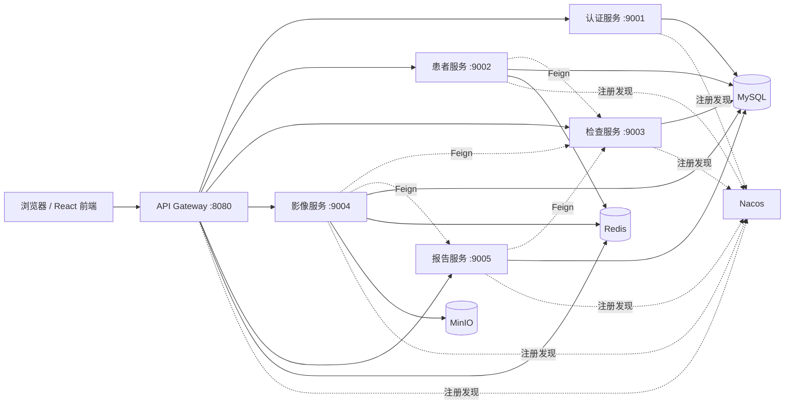
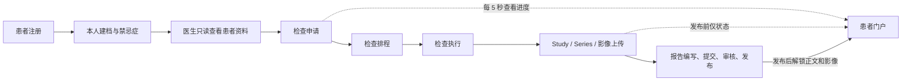
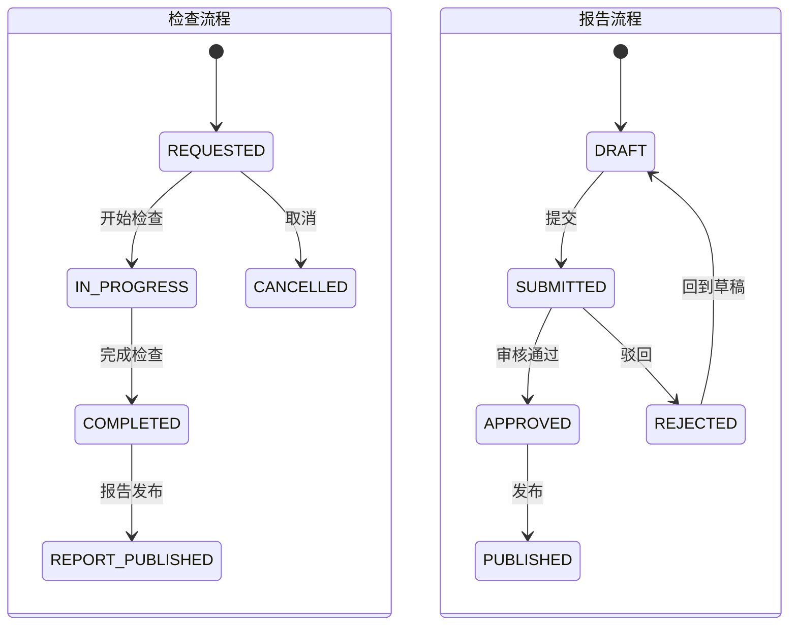

# README Architecture, Features, and Test Evidence Implementation Plan

> **For agentic workers:** REQUIRED SUB-SKILL: Use superpowers:subagent-driven-development (recommended) or superpowers:executing-plans to implement this plan task-by-task. Steps use checkbox (`- [ ]`) syntax for tracking.

**Goal:** Reorganize the root README so project reviewers and maintainers can understand the MRI system architecture, doctor/patient functionality, verified test results, and zero-data delivery state from one document.

**Architecture:** Keep `README.md` as the single edited delivery artifact and reuse authoritative facts from `docs/demo/test-result.md`, `docs/api-endpoint-count.md`, `docs/product-manual.md`, and the current service configuration. Add three compact Mermaid diagrams, then arrange the existing startup, Swagger, test, cleanup, and script instructions beneath the new overview without changing runtime behavior.

**Tech Stack:** Markdown, Mermaid flowcharts/state diagrams, PowerShell validation, Git.

---

## File Map

- Modify: `README.md` — project overview, diagrams, role/function tables, startup instructions, verified test summary, and documentation links.
- Reference only: `docs/demo/test-result.md` — authoritative automation, end-to-end, and zero-data evidence.
- Reference only: `docs/api-endpoint-count.md` — authoritative 78-interface module breakdown.
- Reference only: `docs/product-manual.md` — detailed operational workflow and cleanup guidance.
- Reference only: `docs/demo/video-caption-script.md` — completed 17-minute caption workflow.

### Task 1: Establish the README overview and architecture

**Files:**
- Modify: `README.md`
- Reference: `docker-compose.yml`
- Reference: `mri-gateway/src/main/resources/application.yml`

- [ ] **Step 1: Preserve current user wording**

Confirm that the frontend paragraph remains:

```markdown
前端采用 React + react-router 按功能分页，从登录页进入。主要页面：
```

Do not restore the previously removed sentence about hiding technical terminology.

- [ ] **Step 2: Add a compact project capability summary**

Place a short capability list after the opening paragraph:

```markdown
- 双角色：admin 医生与患者账号。
- 完整链路：患者建档 → 检查申请 → 排程 → 检查执行 → 影像归档 → 报告审核发布。
- 数据隔离：患者只访问本人数据，医生只读患者资料并处理后续业务。
- 分布式基础设施：Gateway、Nacos、Feign、Redis、MySQL、MinIO。
```

- [ ] **Step 3: Add the system architecture Mermaid diagram**

Use this relationship model:



- [ ] **Step 4: Add role boundaries and service/port tables**

The role table must distinguish profile ownership from medical workflow processing. The service table must include frontend 5173, gateway 8080, services 9001–9005, MinIO 9000/9101, Nacos 8848, MySQL 3307, and Redis 6379.

### Task 2: Add functional and workflow documentation

**Files:**
- Modify: `README.md`
- Reference: `docs/product-manual.md`
- Reference: `docs/demo/video-caption-script.md`

- [ ] **Step 1: Add the doctor/patient business-loop Mermaid diagram**



- [ ] **Step 2: Add doctor, patient, and shared-capability sections**

Doctor functionality must cover read-only patient data, exam creation and scheduling, exam state changes, image archive/upload, report workflow, settings, and activity logs. Patient functionality must cover registration, self-owned profile/contraindications, read-only progress, 5-second silent polling, and publication gating. Shared functionality must cover JWT, trusted identity headers, 401/403 semantics, global notifications, Redis, Nacos, Feign, Swagger, and MinIO.

- [ ] **Step 3: Explain scheduling in business language**

Include this exact meaning:

```markdown
检查排程把检查申请落实到具体设备，确定检查时间并分配执行人员；统一排程可避免设备和时间冲突，并为检查状态流转及后续影像归档提供业务依据。
```

- [ ] **Step 4: Add the state-machine Mermaid diagram**



### Task 3: Consolidate startup, API, test, and delivery evidence

**Files:**
- Modify: `README.md`
- Reference: `docs/demo/test-result.md`
- Reference: `docs/api-endpoint-count.md`

- [ ] **Step 1: Retain and regroup startup commands**

Keep the existing infrastructure/service scripts, manual Maven commands, frontend commands, default admin account, gateway URL, Swagger URLs, and cleanup command. Move them below architecture and functionality so the README reads from overview to operation.

- [ ] **Step 2: Add the OpenAPI result table**

Use only these verified values:

| Module | API count |
| --- | ---: |
| Auth/User | 10 |
| Patient | 15 |
| Exam | 18 |
| Image | 22 |
| Report | 13 |
| Total | 78 |

- [ ] **Step 3: Add the verified test result table**

```markdown
| Verification | Result |
| --- | --- |
| Backend `mvn clean test` | 58 passed, 0 failed |
| Frontend `npm test` | 9 passed, 0 failed |
| Frontend production build | Vite 8.0.16, 1582 modules, success |
| Dependency audit | 0 vulnerabilities |
| OpenAPI count | 78 APIs |
| Two-account end-to-end workflow | Passed |
| Final zero-data verification | Passed |
```

- [ ] **Step 4: Summarize the end-to-end and zero-data evidence**

State that registration, first profile submission, contraindications, doctor workflow, multipart upload, publication gating, patient 403 behavior, and post-publication viewing were verified. State that ten business tables, PATIENT accounts, Redis keys, MinIO objects, and local runtime images are zero while admin, roles, and the empty bucket remain.

- [ ] **Step 5: Add documentation links**

Link to:

```markdown
- [产品操作手册](docs/product-manual.md)
- [测试执行结果](docs/demo/test-result.md)
- [接口数量说明](docs/api-endpoint-count.md)
- [开发难点与解决过程](docs/development-challenges.md)
- [A 方式无口播字幕脚本](docs/demo/video-caption-script.md)
```

### Task 4: Validate and commit the README

**Files:**
- Modify: `README.md`

- [ ] **Step 1: Verify required headings and Mermaid blocks**

Run:

```powershell
$text = Get-Content -LiteralPath README.md -Raw
@('系统架构','功能说明','业务流程','状态流转','测试结果','最终交付状态') |
  ForEach-Object { if (-not $text.Contains($_)) { throw "Missing section: $_" } }
if (([regex]::Matches($text, '```mermaid')).Count -ne 3) {
  throw 'README must contain exactly three Mermaid diagrams.'
}
```

Expected: exit code 0.

- [ ] **Step 2: Verify all referenced Markdown files exist**

Run:

```powershell
@(
  'docs/product-manual.md',
  'docs/demo/test-result.md',
  'docs/api-endpoint-count.md',
  'docs/development-challenges.md',
  'docs/demo/video-caption-script.md'
) | ForEach-Object {
  if (-not (Test-Path -LiteralPath $_)) { throw "Missing link target: $_" }
}
```

Expected: exit code 0.

- [ ] **Step 3: Verify authoritative numbers and forbidden wording**

Run:

```powershell
$readme = Get-Content -LiteralPath README.md -Raw
@('58','9','78','Vite 8.0.16','0 vulnerabilities') |
  ForEach-Object { if (-not $readme.Contains($_)) { throw "Missing evidence: $_" } }
rg -n '课程|答辩|毕设|作业|阅卷者|课程教师|教学演示|演示版|考核要求' README.md
```

Expected: all evidence values present; `rg` returns no matches.

- [ ] **Step 4: Run Git whitespace and scope checks**

Run:

```powershell
git diff --check
git status --short
git diff --stat
```

Expected: no whitespace errors; only `README.md` is modified by the implementation task.

- [ ] **Step 5: Commit**

```powershell
git add README.md
git commit -m "docs: expand architecture and verification overview"
```
